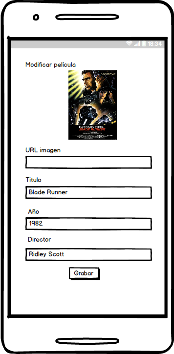

# Laboratorio Angular

Vamos a crear una aplicación simple que contendrá dos páginas:

1. Listado de películas
2. Visualización detalle de películas

## Listado de películas

El listado de películas va a leer los datos de una API REST que nos proporciona una lista de películas.

Vamos a mostrar el siguiente layout:


## Navegación

- Pinchando en una película del listado, vamos a navegar a la página de detalle de la película, donde podemos editarla.

## Edición película

Podemos editar una película existente para ello usaremos el verbo PUT o PATCH de la API REST.



Validaciones formulario:

- URL Imagen:
  - Obligatorio.
  - URL Bien formada.
- Título:
  - Obligatorio.
  - Mínimo 3 caracteres.
- Año
  - Obligatorio.
  - Año entre 1900 y 2100.
- Director
  - Obligatorio.
  - Mínimo 3 caracteres.

# Servidor

En el repositorio de Angular-Lab se incluye una API Rest para pruebas, el repo esta en la siguiente url:

Clonalo a local, una vez clonado, y en la carpeta de trabajo, ejecuta:

```bash
cd server
```

```bash
npm start
```

Se levantara un servidor en el puerto 3001, para acceder al listado de películas, la url:

```
http://localhost:3001/movies
```

# Opcional

Puntos opcionales a entregar:

- Utilizar los controles de Angular Material.
- Añadir funcionalidad de creación de película.
- Añadir un botón de borrado de película.
